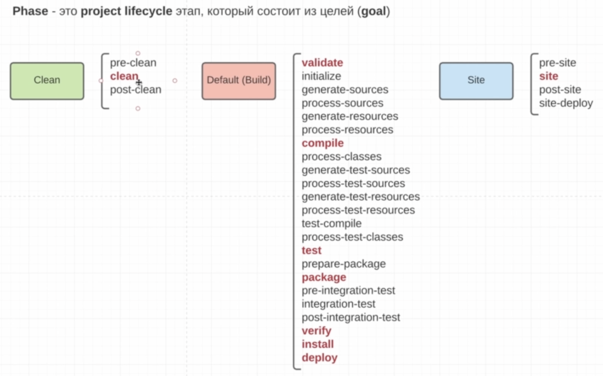

# General Project Information
- ### General
   -   ```<modelVersion>4.0.0</modelVersion>``` - декларация версии дескриптора POM
   -   ```<packaging>jar</packaging>``` - во что будет билдиться проект jar, war, и т.д. а также от него зависит жизненный цикл приложения
   -   ```<name>CustomArchetypeMaven</name>``` - название модуля проекта
   -   ```<url>http://maven.apache.org</url>``` - url проекта
   - ```
         <contributors>
            <contributor>
               <email>some-email</email>
               <name>Valentin</name>
               <organization>Not found</organization>
            </contributor>
         </contributors> - кто участник
  - ```
      <licenses>
         <license>
            <name>No License</name>
            <comments>No comet</comments>
            <distribution>No distribution</distribution>
         </license>
      </licenses> - инфа по лицензии
  - ### POM Relationships
    - ```<groupId>org.example</groupId>``` - groupId artifactId version - предствляют собой уникальный идентификатор проекта
      ```<artifactId>CustomArchetypeMaven</artifactId>```
      ```<version>1.0-SNAPSHOT</version>```
      - ```
         <parent>
           <groupId>org.example</groupId> - указывается в children module, наследуемся от этого модуля
           <artifactId>CustomArchetypeMaven</artifactId>
           <version>1.0-SNAPSHOT</version>
         </parent>
        - ```
            <modules> - указывается в parent module, созависимые модули
              <module>childrenProject</module>         
            </modules>
      - ```
        <dependencyManagement> - указывается в родительском pom, в дочернем нужно только укзать groupId и artifactId для dependency
         <dependencies>
            <dependency>
              <groupId>junit</groupId>
              <artifactId>junit</artifactId>
              <version>3.8.1</version> - groupId artifactId version уникальное имя зависимости 
              <exclusions> - исключение транзитивных зависмостей, чтобы она подтянулась в другой
                 <exclusion>
                   <groupId>org.example</groupId>
                   <artifactId>CustomArchetypeMaven</artifactId>
                 </exclusion>
              </exclusions> 
              <optional>true</optional> - если true они не установятся, но тот кто рабоатет с pom явно должен усановить у себя одну помеченных optional
              <scope>test</scope> - значения на каком этапе понадобиться зависимость значения: 
                     complie - зависмость потребуется на этапе компиляции (jar от нее полностью зависим), 
                     provided - зависимость будет предоставлена кем то другим (например tomcat для jakarta.servlet-api), 
                     runtime - runtime  зависимость driver в jdbc который нужен только на этапе запросов, 
                     system - лежит на лоакльном компе(лучше не использовать), 
                     test - эта зависмость нужна только для выполнения наших тестов
            </dependency>
         </dependencies> - подтягиваемые зависимости (jar файлы)
        </dependencyManagement>
- ### Build Environment
     - ```
        <properties>
           <project.build.sourceEncoding>UTF-8</project.build.sourceEncoding>
        </properties> - глобальные переменные для POM
  - ### Build settings
    - ```<repoting></reporting>``` - внедрение плагинов и т.д. на этапе reporting
      - ```
         <build>
          <finalName>ROOT</finalName>-определение именования архива в packaging (не использовать для multi module)
           <directory>out</directory> - указание декректории куда билдить файлы default папка target
            <pluginManagement> - указывается в родительском pom, в дочернем нужно только укзать groupId и artifactId для plugin
             <plugins> - переопределение плагина для фазы
              <plugin>
                 <groupId>org.apache.maven.plugins</groupId>
                 <artifactId>maven-compiler-plugin</artifactId>
                 <version>3.13.0</version>
                <configuration> - конфигурация плагина
                  <source>23</source>
                  <target>23</target>
                </configuration>
                <executions> - привязка goal к lifecycle maven
                  <execution>
                    <id>custom-execution</id> - кастомный id вызова
                    <goals>
                      <goal>compile</goal> - привязываемая гола
                    </goals>
                    <phase>validate</phase> - фаза к оторой идет приавязка
                  </execution>
                </executions>
              </plugin>
              <plugin>
                <groupId>org.apache.maven.plugins</groupId>
                <artifactId>maven-resources-plugin</artifactId>
                <version>3.3.1</version>
                <executions>
                  <execution>
                    <id>custom-copy-resources</id>
                    <goals>
                      <goal>copy-resources</goal>
                    </goals>
                    <phase>validate</phase>
                    <configuration>
                      <outputDirectory>${project.basedir}/target</outputDirectory>
                      <resources>
                        <resource>
                          <directory>${project.basedir}/src/imageFolder</directory>
                        </resource>
                        <resource>
                          <directory>${project.basedir}/src/main/resources</directory>
                          <filtering>true</filtering> - обрабатывает и подставляет значения в ресурсы из project.*, settings.* (mvn), propertiies.*, env.*, system.getproperty
                        </resource>
                      </resources>
                    </configuration>
                  </execution>
                </executions>
              </plugin>
           </plugins> 
          </pluginManagement>
         <distributionManagement> - настройка деплоя в nexus(артифактори)
            <snapshotRepository> - для версии с snapshot <version>1.0-SNAPSHOT</version>
              <id>nexusSnapshot</id> - id для установки соответствия настроек в ~/.m2/settigs.xml (не забыть прописать тэг server там)
              <url>http://localhost:9000/repository/maven-snapshots/</url> - url в репозитория nexus
            </snapshotRepository>
            <repository> - для версии без snapshot <version>1.0</version>
              <id>nexusReleases</id>
              <url>http://localhost:9000/repository/maven-releases/</url>
            </repository>
         </distributionManagement>
        </build> - настройки стадии билда
- ### Команды для maven
    - `mvn compiler:compile` - запускает plugin: compiler с goal: compile, goal: help посмотреть все goal у плагина
    - `mvn help:effective-pom` - гененрит итоговую pom-ку, в которую включены итоговые плагины, super pom и сама pom
    - `mvn dependency:analyze` - анализирует зависимости, goal tree - строит дерево транзитивных зависимостей 
    - `mvn dependency:tree -Dverbose` -  goal tree - строит дерево транзитивных зависимостей, -Dverbose - более полная инфа 
- ### Фазы maven lifecycle

- `mvn clean` - запускает фазу clean, удаляет папку target 
- `mvn validate` - валидирует проект, проверка в зависмостей 
- `mvn compile` - компилирует проект, обработка исходников и гененрация ресурсов - берет исходники из main src, обрабатывает и кладет их в target, вызываются предыдущие фазы 
- `mvn test` - запускет тесты в проекте
- `mvn package` - запаковывает в указанный архив (jar не включается в себя зависмости), формат определяется в  `<packaging>jar</packaging>`
- `mvn verify` - проеряет что все успешно собралось
- `mvn install` - кладет артифакты в m2 repository - после их можно подключать в другие проекты через dependencies
- `mvn deploy` - кладет артифакты из m2 repository в nexus
